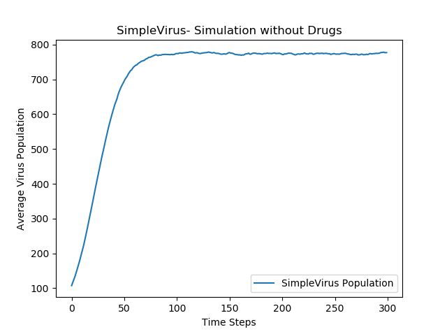
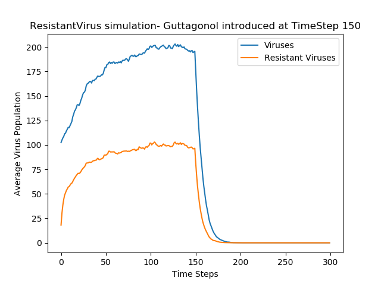

# Achooo
Stochastic simulation of viral population dynamics and drug resistances

Creates 2 types of viruses:
  - SimpleVirus- Does not possess drug resistances
  - ResistantVirus- Can possess drug resistances

The basic idea behind viral population dynamics is that viruses need host cells to multiply. In essence, viral populations are bound by relatively straightforward population density dynamics. Once viral populations reach a maximum threshold, they do not grow/shrink any further unless interrupted by an artificial event (introduction of a drug, access to new host cells, etc.)

### SimpleVirus
The first simulation is that of a SimpleVirus with the following parameters:
  Initial Viral population- 100
  Maximum population possible- 1000
  Birth probability- .1
  Clear probability- .025
  Number of trials- 100
  

### ResistantVirus
The second simulation takes the ResistantVirus class and creates a TreatedPatient instance with the following parameters:
  Initial viral population- 100
  Maximum population possible- 1000
  Birth probability- .3
  Clear probability- .2
  Drug resistances- 'guttagonol' resistance turned off
  Mutation probability- .8
  Number of Trials- 50
  
  Guttagonol is introduced at Time Step 150 and drastically brings down the population of viruses.
  

